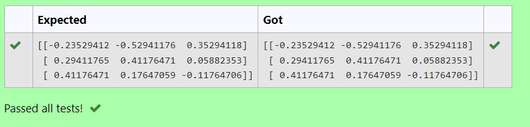

# INVERSE OF A MATRIX
## Aim:
To write a python program to find the inverse of a matrix
## Equipment’s required:
Hardware – PCs , Anaconda – Python 3.7 Installation / Moodle-Code Runner
## Algorithm:
- Step 1: Import numpy as np
- Step 2: Initialize the matrix using np.array
- Step 3: Calculate the rank of the matrix using np.linalg.rank
- Step 4: Print the result
## Program:
```
#Program to find the inverse of a matrix.
#Developed by: ROHIT JAIN D
#RegisterNumber: 212222230120
import numpy as np
a=np.array([[1,0,3],[-1,2,-2],[2,3,-1]])
inverse=np.linalg.inv(a)
print(inverse)
```
## Output:

## Result:
Thus the inverse of given matrix is successfully solved using python program.
